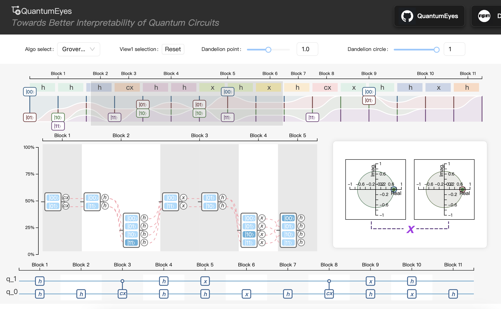

# Explainable Quantum Circuit - Online System

> Author: Shaolun Ruan
>
> contact: slruan.2021@phdcs.smu.edu.sg
> 
> Team: Shaolun Ruan, Yong Wang, Qiang Guan
> 

This is an online system for explainable quantum circuit design, which is based on the paper
"QuantumEyes: Towards Better Interpretability of Quantum Circuits" 
(https://arxiv.org/abs/2311.07980).

### Visit
To access the online system, please visit: https://quantumeyes.github.io/

